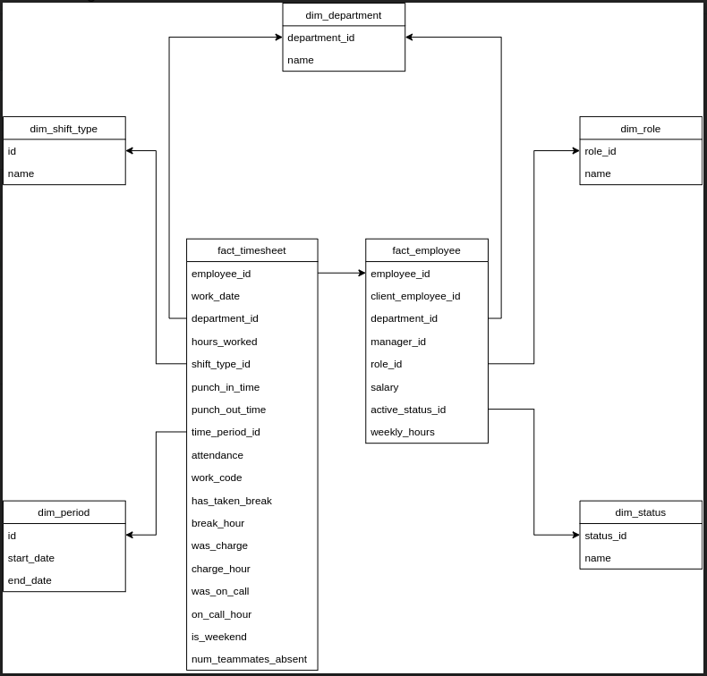

# Steps

- Get the data from the different source
- Create raw table schemas
- Add data into the raw table
- Archive all the data from raw tables
- Create the required table schema
- Transform the data as requirements
- Load the data into database

## Get the data from the different source

Using python
we can download the csv, json or xml file to our server and place them in the `data` directory.

## Create raw table schemas

We have 2different sets of data

- Employees
- Timesheets

The raw structure of Employees and timesheets from the data are:

- Employees

```
employee_id
first_name
last_name
department_id
department_name
manager_employee_id
employee_role
salary
hire_date
terminated_date
terminated_reason
dob
fte
location
```

- Timesheets

```
employee_id
cost_center
punch_in_time
punch_out_time
punch_apply_date
hours_worked
paycode
```

#### SQL for creating Raw table schemas

```sql
-- Creating raw_employees table
CREATE TABLE raw_employees (
  employee_id VARCHAR(255),
  first_name VARCHAR(255),
  last_name VARCHAR(255),
  department_id VARCHAR(255),
  department_name VARCHAR(255),
  manager_employee_id VARCHAR(255),
  employee_role VARCHAR(255),
  salary VARCHAR(255),
  hire_date VARCHAR(255),
  terminated_date VARCHAR(255),
  terminated_reason VARCHAR(255),
  dob VARCHAR(255),
  fte VARCHAR(255),
  location VARCHAR(255),
);

-- Creating raw_timesheets table
CREATE TABLE raw_timesheets(
  employee_id VARCHAR(255),
  cost_center VARCHAR(255),
  punch_in_time VARCHAR(255),
  punch_out_time VARCHAR(255),
  punch_apply_date VARCHAR(255),
  hours_worked VARCHAR(255),
  paycode VARCHAR(255),
);
```

We use all VARCHAR(255) because ... 

# Add data into the raw table

Read the source file and populate the data into the raw table.

# Archive all the data from raw tables
After create the archive table for employees and timesheets. We need to archive the data from the raw table to respective archive table. 

# Schema 

